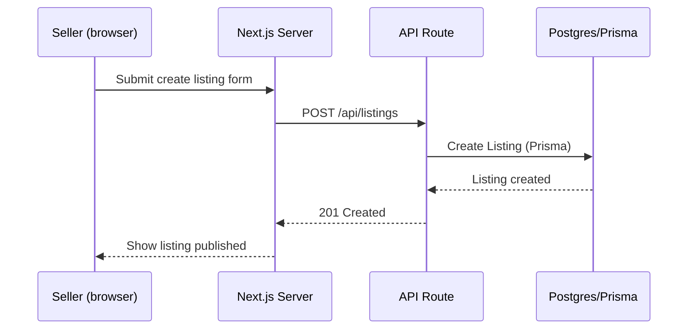
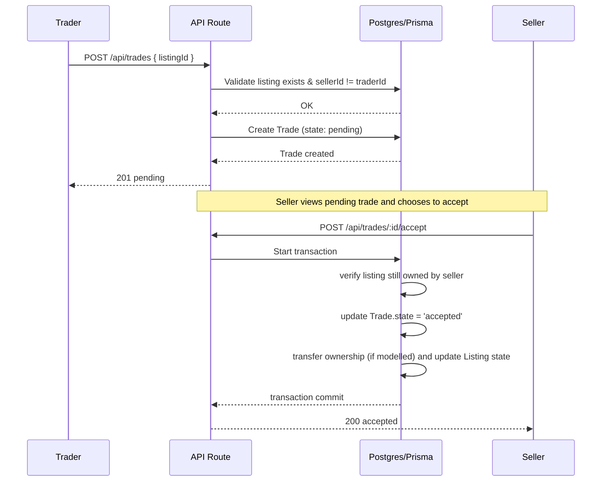

# Architecture: Listing & Trade

## Overview

This document describes the system components and key flows for the Listing & Trade feature. Implementation targets: Next.js (app router) + Prisma + PostgreSQL for persistence. UI components are server-first; interactive confirmations use small client wrappers.

## High-level component diagram

```mermaid
graph TB
  Web[Web UI - Next.js]
  API[API Routes (Next.js Server)]
  Better Auth[Auth Service]
  Prisma[Prisma Client]
  Postgres[(Postgres DB)]
  Storage[(Object Storage)]

  Web -->|fetch/POST| API
  API -->|queries| Prisma
  Prisma --> Postgres
  API -->|auth checks| Auth
  API -->|uploads| Storage
```

## Key Components

- Web UI (Next.js app router): Server Components for `ListingCard`, `ListingPage`; `TradeDialog` has a small client wrapper for accept/cancel actions.
- API Routes (`app/api/listings`, `app/api/trades`): typed handlers using Zod for input validation and Prisma for DB interactions.
- Persistence: PostgreSQL (primary), Prisma as ORM. Use transactions for trade state transitions.
- Storage: images (S3-compatible) — abstracted behind upload service.

## Data Model (core types)

Example simplified TypeScript types (reference):

```ts
export type PriceCents = number

export interface Listing {
  id: string
  gameId: string
  sellerId: string
  priceCents: PriceCents
  state: 'draft' | 'published'
  createdAt: string
  updatedAt: string
}

export interface Trade {
  id: string
  listingId: string
  initiatorId: string
  responderId?: string
  state: 'pending' | 'accepted' | 'cancelled' | 'completed'
  createdAt: string
  updatedAt: string
}
```

## Prisma considerations

- Model `Listing` and `Trade` with foreign keys to `User`.
- Use `@@unique` constraints where appropriate (e.g., prevent duplicate pending trades on same listing by same initiator).
- Use Prisma transactions (`prisma.$transaction`) to implement atomic trade acceptance and ownership transfer.

## API Surface

- `GET /api/listings` — list + filters
- `GET /api/listings/:id` — get listing
- `POST /api/listings` — create listing (auth: seller)
- `PATCH /api/listings/:id` — update listing (auth: seller)
- `POST /api/trades` — initiate trade (validates initiator owns offered item(s) or offers money)
- `POST /api/trades/:id/accept` — accept trade (transactional finalization)
- `POST /api/trades/:id/cancel` — cancel trade

## Sequence: Create Listing



## Sequence: Initiate Trade -> Accept (atomic)



Key implementation notes: ensure the accept flow runs inside a DB transaction to avoid races.

## Infra & Deployment

- Host: Vercel (Next.js) for frontend + serverless API routes, or a dedicated Node server for Prisma connection pooling depending on scale.
- DB: Managed PostgreSQL (connection pooling recommended — e.g., PgBouncer) for stable Prisma connections.

## Observability & Ops

- Emit traces for listing creation and trade flows; log trade state transitions.
- SLOs: track API error rates and latency for trade endpoints.

## Security

- Authenticate all write endpoints. Authorize by verifying `req.user.id` equals resource owner for seller-only actions.
- Rate-limit trade initiation endpoints to reduce abuse.

## Open Decisions (link ADRs)

- Ownership transfer model: do we represent ownership as a field on `Listing` or by moving records? See ADR: docs/adr/0001-ownership-model.md (suggest creating).

---

If you want, I can scaffold a small Prisma schema snippet and the initial `app/api/trades/route.ts` handler as a unified patch next. No new packages will be added.
